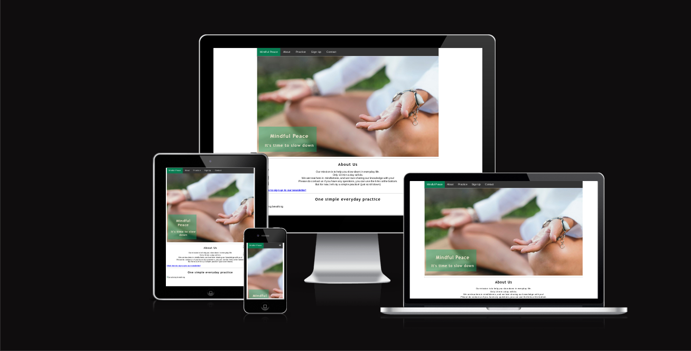
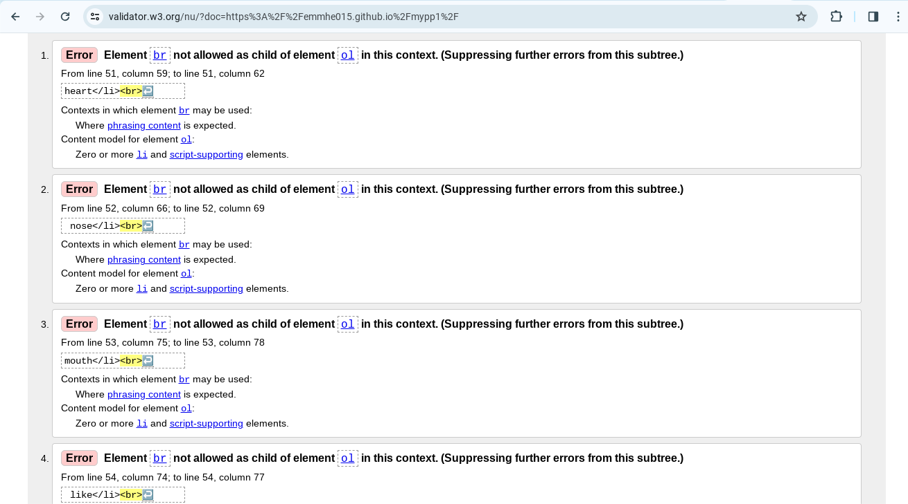
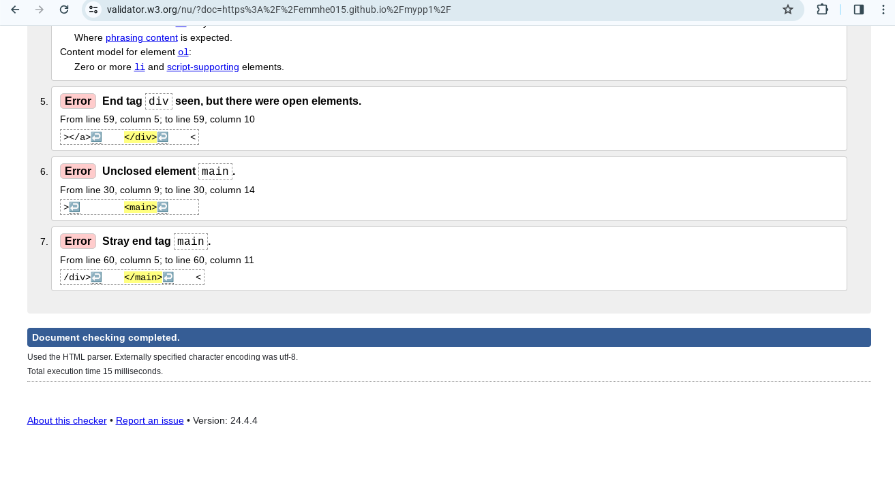
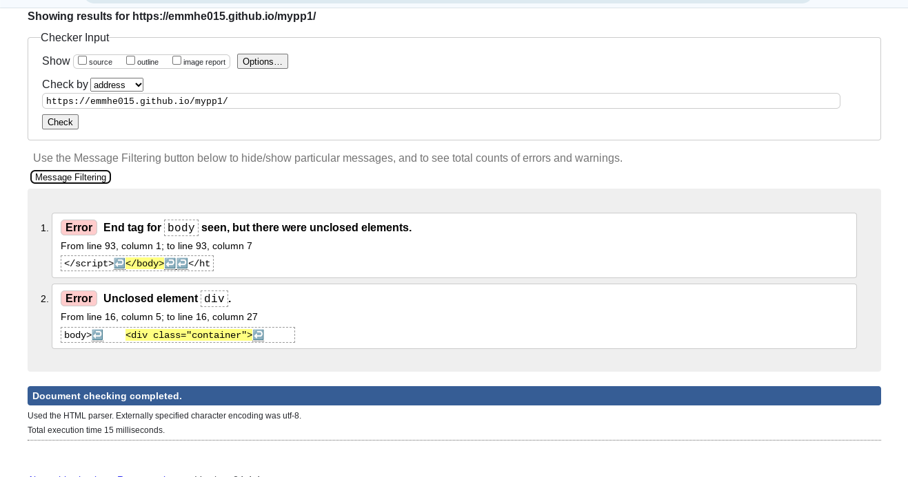
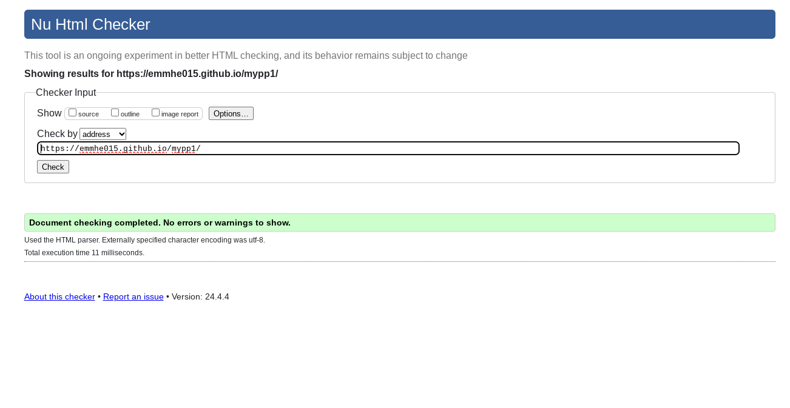
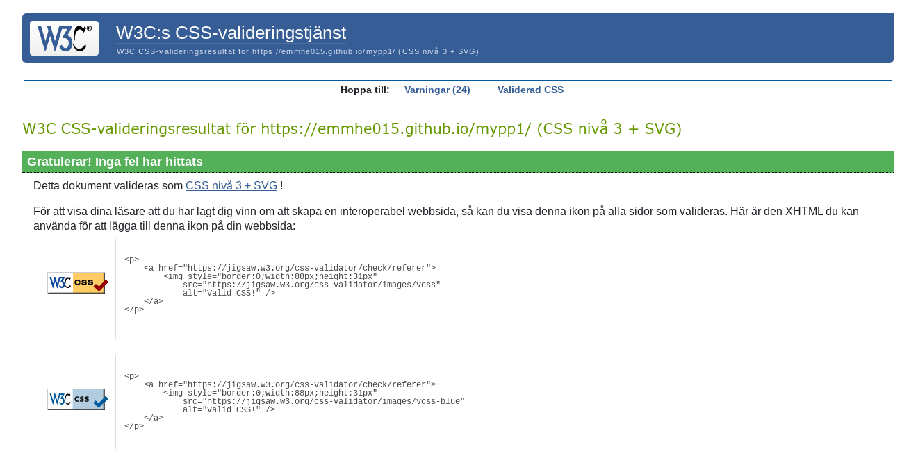
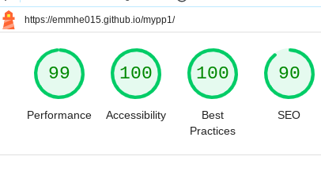

# Mindful Peace

The Mindful Peace website is for users who wants to know more about mindfulness and learn a simple practice. 

## Features
- **Navigation**
    - At the top of the page is the navigation bar. The Mindful Peace is to the left and links to the start of the page. 
    - The other navigation links is About, Practice, Sign Up and Contact. It directs the users to the diffrent sections and sign up page.  
        
- **Main content**
    - The main content includes a _hero image_ that reminds the user to slown down.
    - It contains a short _About us_ section with a little information about the creator of the website and the function of the site. 
    - Under the About section is a _Sign Up_ form for the newsletter. Name and email is requiered.
    - When submitted to newsletter, you are beeing redirected to a thank you page. 
    - The sign up form follows by a section of a simple _Practice_ with music, image and an ordered list. 
    - The _Footer_ is at the bottom, with links to different social media websites that opens in a new tab, is also found in the videos.html file.  
    - The _Yoga videos_ or videos.html is based upon three different yoga videos. Each one depending on which time of the day it is. 

## Design
- **Colour Scheme**
    - The website features a calming color palette that includes shades of white and green to evoke a sense of peace and tranquility. 
    - Accent colors are used sparingly to draw attention to call-to-action buttons and important information.
- **Fonts**
    - The primary font used throughout the website is 'Lucinda sans', which is known for its readability and clean look.
    - Headings use 'Trebuchet MS' to provide a classic and elegant feel.
- **Layout**
    - The layout is clean and simple, with plenty of white space to avoid overwhelming the user.
    - Sections are clearly defined, and the navigation is intuitive, making it easy for users to find the information they need.

## Testing
- I confirm that the links in the nav, newsletter sign up form and the footer is working correctly. 
- I confirm that the content on the site is readable and easy to understand.  

### Detailed Testing
| Feature                | Test Description                            | Passed       |
|------------------------|---------------------------------------------|--------------|
| Navigation Links       | Clicked on each navigation link             | ✔️           |
| Newsletter Sign-Up Form| Entered name and email, submitted form      | ✔️           |
| Social Media Links     | Clicked on each social media icon           | ✔️           |
| Hero Image             | Confirmed image loads correctly             | ✔️           |
| About Section          | Checked for readability and content clarity | ✔️           |
| Practice Section       | Confirmed music plays, image loads          | ✔️           |
| Footer Links           | Clicked on each footer link                 | ✔️           |
| Youtube Videos         | Played each video                           | ✔️           |
| Thank you page         | Submitted to newspapper, thank you page was loaded                           | ✔️           |

## Bugs 
When I tested the website in HTML validator (W3C), the result showed following errors:

 - I went back and fixed the errors, tested again and got the following result;

- Went back and fixed the errors that were remaining and got this result;

## Validator Testing
 ### CSS Validation
 

 ### HTML Validation
 

 ### Lighthouse testing 

## Deployment
1. Select project, go to the Settings tab of your GitHub repository.
2. On the left-hand > under Code and automation section, select Pages.
3. under build and deployment >set Source to 'Deploy from Branch'. Main branch is selected. Folder is set to / (root).
4. Under Branch, click Save.
5. Go back to the Code tab. Wait a few minutes for the build to finish and refresh your repo.
6. On the right-hand side, in the Environments section, click on 'Github-pages'.

### Cloning the Repository
To clone the repository:
1. Navigate to the GitHub repository page.
2. Click on the 'Code' button.
3. Copy the URL from the HTTPS tab.
4. Open your terminal or Git Bash.
5. Type `git clone` followed by the URL you copied and press Enter.

### Forking the Repository
To fork the repository:
1. Navigate to the GitHub repository page.
2. Click on the 'Fork' button at the top right of the page.
3. This will create a copy of the repository in your GitHub account, which you can then clone or modify as needed.

## Credits
- The images in the index.hmtl is from https://www.canva.com/
- Navbar code is from https://www.w3schools.com/
- The videos is from https://www.youtube.com/
- The icons in the footer is from https://fontawesome.com/ 
- The Audio file is from https://www.jamendo.com/playlist/500607433/time-to-dream 
- The section of Deployment in this ReadMe is from https://github.com/joelsita/project-one?tab=readme-ov-file#testing  
- I followed instructions from the Love Running project.
- Many thanks to my mentor Spence for all the support!